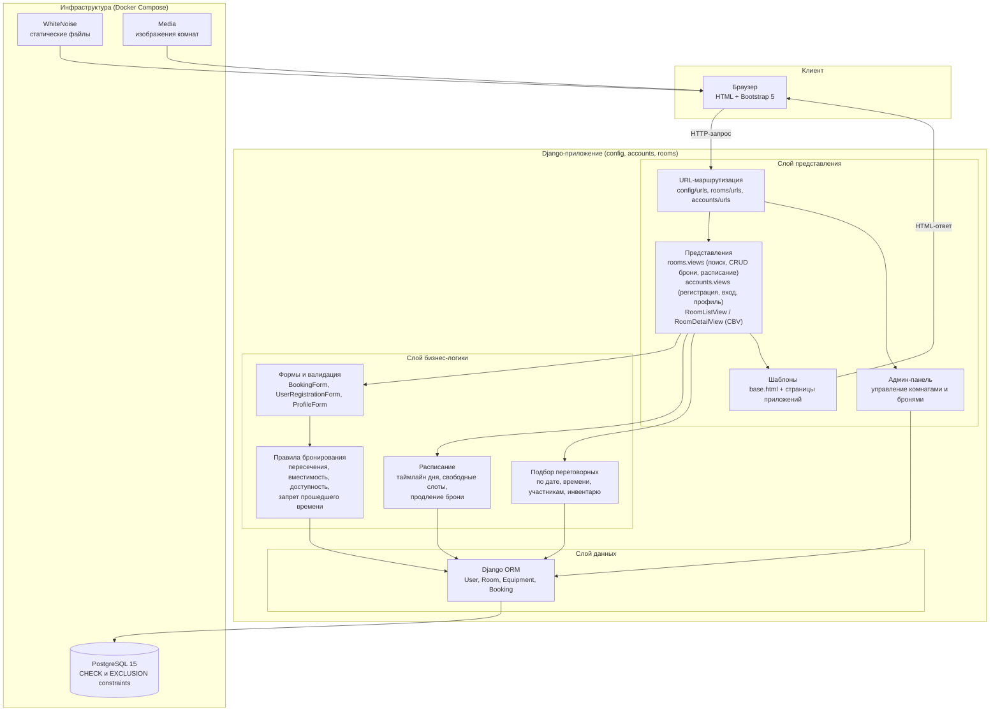
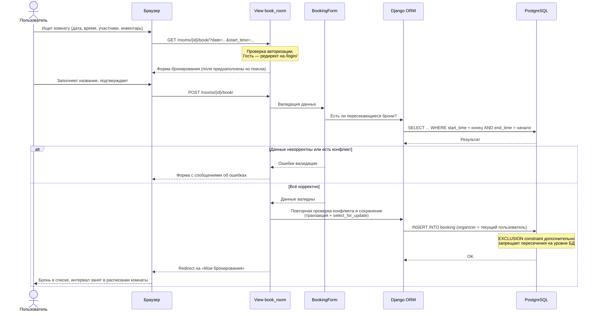

# Архитектура проекта «Booked!»

Документ содержит схему сервисов (слои приложения) и схему взаимодействия
для ключевого сценария. Схема базы данных — в файле `ER_diagram.drawio` /
`ER_diagram.png`.

## Схема сервисов (слои приложения)

**Описание слоёв:**

| Слой | Ответственность |
|------|-----------------|
| Клиент | Отрисовка страниц (Bootstrap 5), отправка форм и GET-параметров поиска |
| Представление | Маршрутизация URL, обработка запросов, рендер шаблонов, права доступа (`login_required`, фильтр по владельцу брони) |
| Бизнес-логика | Валидация форм, проверка пересечений/вместимости/доступности, построение расписания и свободных слотов, подбор комнат |
| Данные | Django ORM: модели и связи (FK `Booking→User`, `Booking→Room`; M2M `Room↔Equipment`) |
| Инфраструктура | PostgreSQL (ограничения целостности на уровне БД), WhiteNoise для статики, Docker Compose для запуска |

## Схема взаимодействия: сценарий «Создание бронирования»

