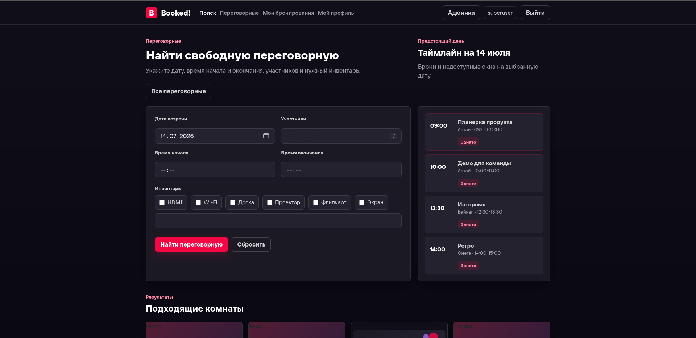
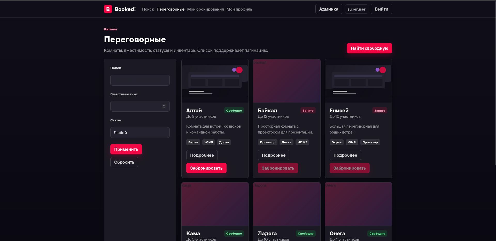
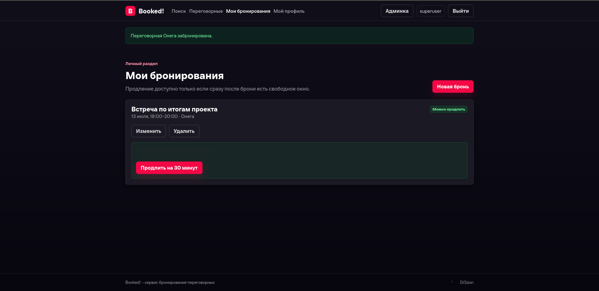
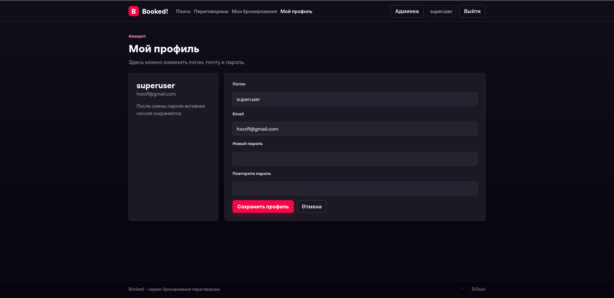

# Booked!

Сервис поиска и бронирования переговорных комнат.

---


---

## Команда
- Понарин Алексей
- Ханана Софья 
- Милютин Николай
- Ахмедзянов Артём 
- Шулаев Ярослав

---

## Оглавление
- [Развертывание](#развертывание)
- [Тесты](#тесты)
- [Модели](#модели)
- [Скриншоты](#скриншоты)
- [Видео-демо](#видео)
- [Документация](#документация)

---

## Технологии
- Python 3.10+
- Django 5.2.16
- PostgreSQL
- Gunicorn
- WhiteNoise
- Pillow
- python-dotenv
- Bootstrap 5

---

## Развёртывание

### 1. **Клонировать репозиторий**
   ```bash
   git clone <ссылка>
   cd <название_проекта>
   ```

### 2. **Настроить переменные окружения**
   Скопируйте пример файла конфигурации и отредактируйте .env, указав свои данные для PostgreSQL:
   ```bash
   cp .env.example .env
   ```

### 3. **Запустить проект через Docker:**
   ```bash
   docker-compose -f docker/docker-compose.yml up --build
   ```

### 4. **Выполнить миграции:**
   ```bash
   docker-compose -f docker/docker-compose.yml exec web python manage.py migrate
   ```

### 5. **Создать суперпользователя:**
   ```bash
   docker-compose -f docker/docker-compose.yml exec web python manage.py createsuperuser
   ```

Приложение будет доступно по адресу http://127.0.0.1:8000/. Nginx проксирует приложение и обслуживает фотографии из `/media/` при `DEBUG=False`.

Остановка:

```bash
docker compose -f docker/docker-compose.yml down
```

---

## Тесты 
   Запуск тестов :
   ```bash
   docker-compose -f docker/docker-compose.yml exec web pytest
   ```

---

## Модели

Проект использует 4 модели:

- **User** — кастомная модель пользователя (AbstractUser). Хранит логин, email, пароль, имя, фамилию.

- **Room** — переговорная комната. Поля: название, вместимость, описание, фото. Связана с Booking через ForeignKey (одна комната — много бронирований) и с Equipment через ManyToMany (много ко многим).

- **Booking** — бронирование. Поля: пользователь, комната, дата, время начала, продолжительность, статус. У пользователя может быть много бронирований, у комнаты — много бронирований.

- **Equipment** — оборудование. Поля: название, описание. Связана с Room через ManyToMany (одно оборудование может быть во многих комнатах, в комнате — много оборудования).

---

## Скриншоты



*Главная страница содержит форму поиска с фильтрацией по дате, времени, количеству участников и инвентарю, а также таймлайн с расписанием бронирований на выбранную дату.*




*Список всех переговорных комнат с пагинацией (5-10 элементов на страницу), фильтрацией по вместимости и статусу, а также отображением доступного оборудования.*




*Личный кабинет пользователя со списком всех его бронирований. Доступны функции продления, редактирования и удаления бронирования.*




*Страница управления профилем пользователя: изменение логина, email и пароля. После смены пароля активная сессия сохраняется.*

---

## Видео-демо


---

## Документация

- Схема БД: См. файл /docs/ER_diagram.drawio.
- Декомпозиция: См. файл /docs/DECOMPOSITION.md.
